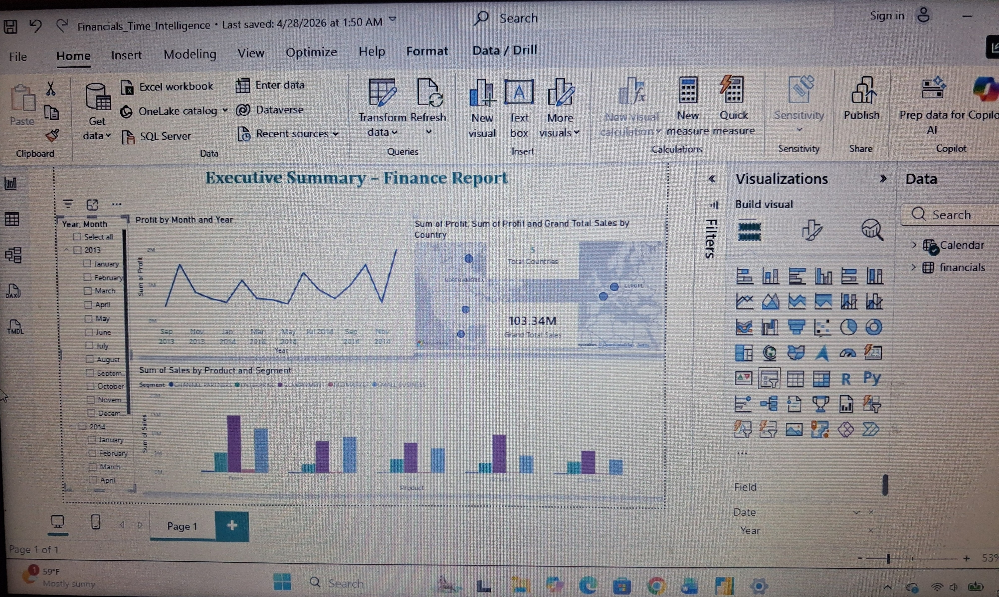
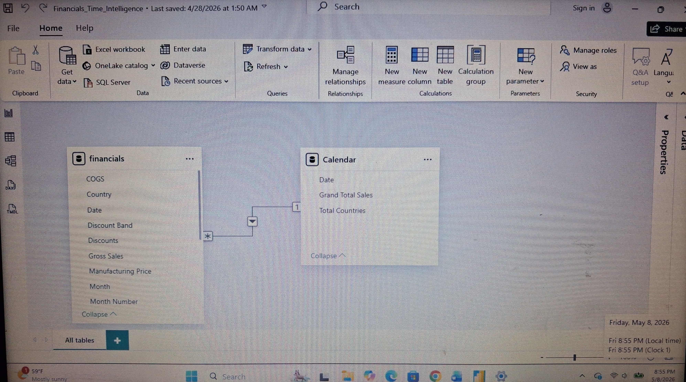
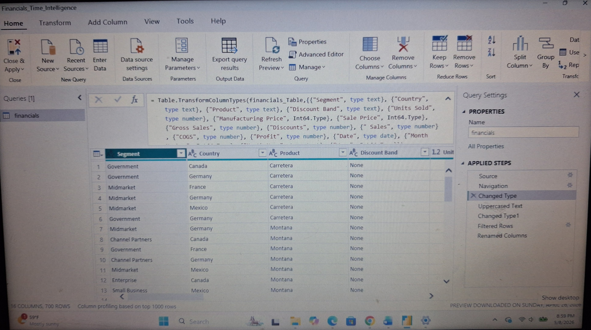

# Power BI Dashboard Project

## Overview
This project demonstrates data analysis and visualization using Power BI, including data cleaning, modeling, and interactive reporting.

## Dashboard Preview

## Data Model

## Data Cleaning (Power Query)

## Interactivity
The dashboard includes interactive slicers that allow users to filter the data by year.  
In this example, the slicer is set to **2023**, demonstrating dynamic filtering of the visualizations.

## Key Skills Demonstrated

- Data cleaning and transformation (Power Query)
- Data modeling and relationships
- Dashboard design and visualization
- Interactive filtering and reporting

## Tools Used

- Power BI
- Data modeling
- Power Query
